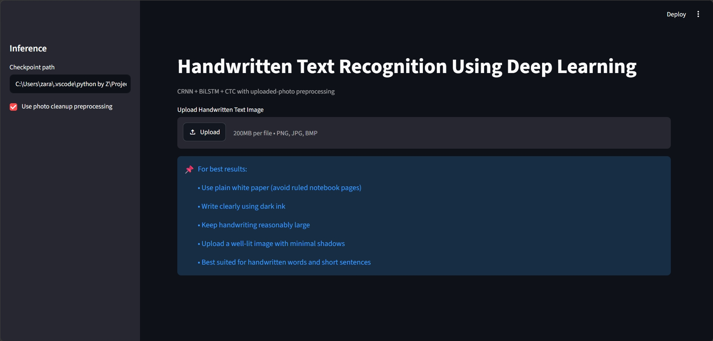
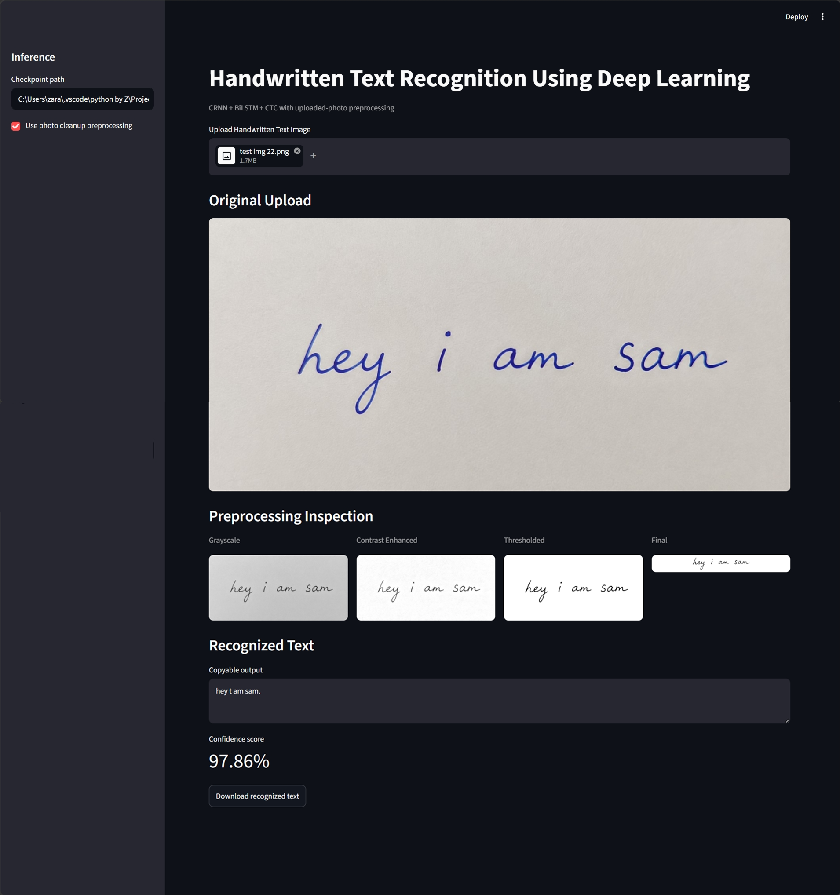
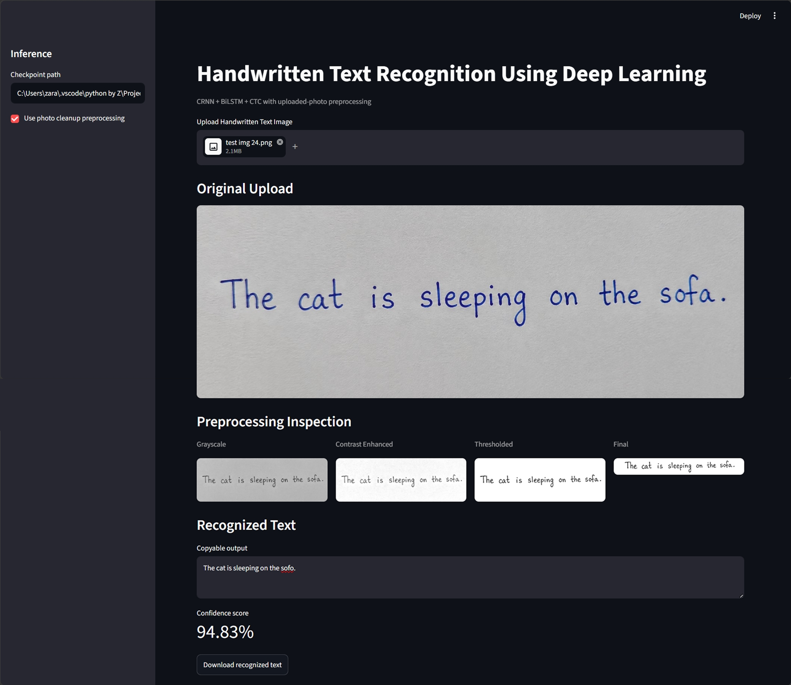
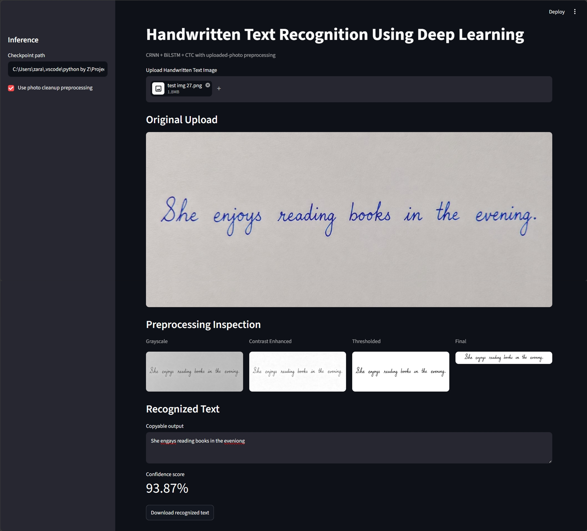

# Handwritten Text Recognition Using Deep Learning

CodeAlpha Machine Learning Internship Project

This project is a deep learning based Handwritten Text Recognition (HTR) system that converts handwritten words and short sentences into editable digital text.

The system is built using a CRNN (Convolutional Recurrent Neural Network) architecture that combines Convolutional Neural Networks (CNNs) for feature extraction, Bidirectional LSTMs for sequence learning, and Connectionist Temporal Classification (CTC) decoding for text prediction.

A user-friendly Streamlit web application is included, allowing users to upload an image of handwritten text, view each preprocessing stage, and obtain the recognized text along with a confidence score.

The model was trained using publicly available handwritten text datasets and enhanced with a custom preprocessing pipeline designed to improve recognition on real-world handwritten images.

## Highlights

- Deep learning based handwritten text recognition using a CRNN architecture
- CNN + Bidirectional LSTM + CTC decoding pipeline
- Trained on multiple handwritten text datasets
- Custom image preprocessing pipeline using OpenCV
- Automatic shadow reduction and contrast enhancement
- Noise removal and handwriting-focused cropping
- Recognition of handwritten words and short sentences
- Real-time predictions through a Streamlit web application
- Preprocessing visualization (Grayscale, Contrast Enhanced, Thresholded, Final)
- Confidence score for every prediction
- Download recognized text as a TXT file
- Fully implemented in Python using PyTorch and Streamlit
- No external OCR engines such as Tesseract are used

## Project Structure

```text
CodeAlpha_HandwrittenTextRecognition/
├── app/
│   └── streamlit_app.py
├── saved_models/
│   └── best_crnn_ctc.pt
├── src/
│   ├── __init__.py
│   ├── config.py
│   ├── dataset_loader.py
│   ├── evaluate.py
│   ├── metrics.py
│   ├── model.py
│   ├── predict.py
│   ├── preprocessing.py
│   └── train.py
├── .gitignore
├── project_report.md
├── README.md
└── requirements.txt
```
> Note: Large dataset files are not included in the GitHub repository due to storage limitations. During training, additional datasets are automatically downloaded from Hugging Face and merged with the local IAM dataset.

## Datasets

The model was trained on a merged dataset created from three sources:

1. Local IAM dataset stored as Parquet files:
   - train.parquet
   - validation.parquet
   - test.parquet

2. Bibek130/IAM-line (Hugging Face)

3. alpayariyak/IAM_Sentences (Hugging Face)

The training pipeline automatically merges these datasets, removes duplicate samples, rebuilds the character vocabulary, and creates unified train, validation, and test loaders.


## Model Architecture

The handwritten text recognition system is built using a CRNN (Convolutional Recurrent Neural Network) with CTC (Connectionist Temporal Classification) decoding.

### Architecture Overview

1. **Input Image**

   * Handwritten image is converted to grayscale.
   * Image preprocessing includes shadow reduction, contrast enhancement, adaptive thresholding, noise removal, handwriting-focused cropping, and aspect-ratio-preserving resizing.

2. **CNN Feature Extractor**

   * Multiple convolutional layers extract visual handwriting features.
   * Pooling layers reduce spatial dimensions while preserving important character information.

3. **Sequence Conversion**

   * CNN feature maps are transformed into a sequential representation.
   * Each vertical feature column becomes one time step for sequence learning.

4. **Bidirectional LSTM Layers**

   * Bidirectional LSTMs learn contextual information from both left-to-right and right-to-left directions.
   * This improves recognition of characters that depend on neighboring characters.

5. **Character Classifier**

   * A fully connected layer predicts character probabilities for each time step.

6. **CTC Loss**

   * Connectionist Temporal Classification (CTC) enables training without character-level segmentation.
   * The model learns alignment between image regions and target text automatically.

7. **CTC Decoding**

   * Greedy CTC decoding removes repeated predictions and blank tokens to generate the final recognized text.

### Technologies Used

* PyTorch
* OpenCV
* NumPy
* Hugging Face Datasets
* Streamlit


## Setup

### 1. Clone the Repository

```bash
git clone https://github.com/Zararazzaq04/CodeAlpha_tasks/tree/main/CodeAlpha_HandwrittenTextRecognition
cd CodeAlpha_HandwrittenTextRecognition
```

### 2. Create a Virtual Environment

```bash
python -m venv .venv
```

### 3. Activate the Virtual Environment

**Windows**

```bash
.venv\Scripts\activate
```

**Linux / macOS**

```bash
source .venv/bin/activate
```

### 4. Install Dependencies

```bash
pip install -r requirements.txt
```

### 5. Dataset Preparation

The project uses a merged handwriting dataset consisting of:

* Local IAM dataset stored in Parquet format
* Bibek130/IAM-line (Hugging Face)
* alpayariyak/IAM_Sentences (Hugging Face)

The local dataset should be placed inside:

```text
dataset/
└── huggingface_iam/
    ├── train.parquet
    ├── validation.parquet
    └── test.parquet
```

During training, additional Hugging Face datasets are automatically downloaded and merged with the local dataset.

### 6. Verify Model Checkpoint

The trained model should be located at:

```text
saved_models/
└── best_crnn_ctc.pt
```


## Training

Train the CRNN model using the merged handwriting dataset:

```bash
python src/train.py
```

### Custom Training Example

```bash
python src/train.py --epochs 50 --batch-size 16 --image-width 512
```

### Training Pipeline

The training script automatically:

1. Loads the local IAM Parquet dataset.
2. Downloads and loads additional Hugging Face handwriting datasets.
3. Merges all datasets into a unified training set.
4. Removes duplicate samples.
5. Rebuilds the character vocabulary.
6. Applies data augmentation during training.
7. Trains the CRNN model using CTC loss.
8. Evaluates performance on the validation set.
9. Saves the best model checkpoint based on validation CER (Character Error Rate).

### Training Outputs

The best model checkpoint is saved to:

```text
saved_models/best_crnn_ctc.pt
```


### Metrics Tracked During Training

* Training Loss
* Validation Loss
* Character Error Rate (CER)
* Word Error Rate (WER)
* Exact Match Accuracy


## Evaluation

Evaluate the trained model using:

```bash
python src/evaluate.py
```

### Evaluation Process

The evaluation script:

1. Loads the trained CRNN model checkpoint.
2. Loads the validation and test datasets.
3. Runs inference on unseen handwriting samples.
4. Compares predictions with ground-truth text.
5. Calculates OCR-specific performance metrics.

### Evaluation Metrics

* **CER (Character Error Rate)** – Measures character-level recognition errors.
* **WER (Word Error Rate)** – Measures word-level recognition errors.
* **Exact Match Accuracy** – Percentage of samples predicted perfectly.
* **CTC Loss** – Measures prediction quality during validation.

### Final Validation Results

| Metric               | Value  |
| -------------------- | ------ |
| Validation Loss      | 0.2505 |
| CER                  | 0.0610 |
| WER                  | 0.2184 |
| Exact Match Accuracy | 16.29% |

These results demonstrate that the model can accurately recognize clean handwritten words and short sentences while maintaining a low character error rate.


## Prediction

Run handwriting recognition from the command line:

```bash
python src/predict.py path/to/image.png
```

### Example

```bash
python src/predict.py sample.png
```

### Example Output

```text
Recognized Text:
I am going to udaipur, for a 3 day trip.

Confidence:
95.50%
```

### Supported Input Images

For best recognition accuracy:

* Use plain white paper whenever possible.
* Write clearly using dark ink.
* Keep handwriting reasonably large and well spaced.
* Ensure good lighting when capturing the image.
* Avoid heavy shadows and strong image compression.

### Known Limitations

Recognition accuracy may decrease when:

* Handwriting is written on ruled or lined notebooks.
* Characters overlap heavily.
* Text is extremely small.
* Images are blurry or poorly illuminated.
* Handwriting is highly decorative or stylized.


## Usage Guidelines

For the best recognition accuracy, follow these recommendations when uploading handwritten images:

### Recommended

* Use plain white paper.
* Write using dark blue or black ink.
* Keep handwriting clear and reasonably large.
* Leave adequate spacing between words.
* Capture images under good lighting conditions.
* Keep the camera directly above the page when taking photos.
* Ensure the text is horizontally aligned.

### Avoid

* Ruled or lined notebook paper.
* Extremely small handwriting.
* Blurry or low-resolution images.
* Strong shadows across the page.
* Decorative or highly stylized handwriting.
* Overlapping words or characters.

Following these guidelines significantly improves recognition accuracy and confidence scores.


## Streamlit App

Launch the web application:

```bash
streamlit run app/streamlit_app.py
```

### Features

* Upload handwritten text images
* Real-time handwriting recognition
* Confidence score for predictions
* Advanced preprocessing pipeline
* Visualization of every preprocessing stage
* Download recognized text as a TXT file
* Clean and user-friendly interface

### Preprocessing Visualization

The application displays the complete preprocessing pipeline:

1. Grayscale Image
2. Contrast Enhanced Image
3. Thresholded Image
4. Final Processed Image

This helps users understand how the model prepares handwritten images before recognition.

### Recommended Usage

For best results:

* Use plain white paper instead of ruled notebooks.
* Write clearly and avoid very small handwriting.
* Use dark ink with good contrast against the background.
* Capture images under good lighting conditions.
* Keep the text horizontally aligned whenever possible.

The model performs best on clean handwritten words and short sentences written on blank paper.


## Screenshots

### Application Interface

The Streamlit application provides an interactive interface for handwritten text recognition. Users can upload an image, inspect each preprocessing stage, and view the recognized text along with a confidence score.



---

### Example 1 – Simple Handwriting

Input handwritten text:

> hey i am sam

Prediction:

> hey t am sam.

Confidence Score: **97.86%**



---

### Example 2 – Printed Handwriting

Input handwritten text:

> The cat is sleeping on the sofa.

Prediction:

> The cat is sleeping on the sofo.

Confidence Score: **94.83%**



---

### Example 3 – Cursive Handwriting

Input handwritten text:

> She enjoys reading books in the evening.

Prediction:

> She engays reading books in the eveniong

Confidence Score: **93.87%**



> Note: Minor spelling variations occur depending on handwriting style, image quality, lighting conditions, and character spacing.


## Results

The trained CRNN model was evaluated on both validation data and real-world handwritten images.

### Validation Performance

| Metric | Value |
|----------|----------|
| Validation Loss | 0.2505 |
| Character Error Rate (CER) | 0.0610 |
| Word Error Rate (WER) | 0.2184 |
| Exact Match Accuracy | 16.29% |

### Real-World Prediction Results

The model was tested on handwritten samples from multiple writers and writing styles, including:

- Simple handwriting
- Printed handwriting
- Cursive handwriting

Observed confidence scores ranged from **93% to 98%** on clean handwritten images.

### Key Observations

- High accuracy on clearly written words and short sentences.
- Performs well on different handwriting styles.
- Custom preprocessing significantly improves recognition quality.
- Robust to moderate lighting variations and mobile-phone photographs.
- Best performance is achieved on plain white paper with dark ink.

### Conclusion

The developed Handwritten Text Recognition system successfully combines deep learning and image preprocessing techniques to recognize handwritten text from real-world images. The model demonstrates strong performance on short handwritten phrases and provides an effective end-to-end OCR solution through an easy-to-use Streamlit application.


## Internship Notes

This project was developed as part of the CodeAlpha Machine Learning Internship.

### Skills Demonstrated

* Deep Learning
* Computer Vision
* Image Preprocessing
* Optical Character Recognition (OCR)
* Sequence Modeling
* PyTorch Development
* Dataset Engineering
* Model Evaluation
* Streamlit Application Development

### Project Outcomes

* Developed a complete handwritten text recognition pipeline.
* Implemented a CRNN architecture using CNNs, BiLSTMs, and CTC decoding.
* Trained the model on multiple handwriting datasets.
* Built a custom preprocessing pipeline for real-world handwritten images.
* Created an interactive Streamlit application for end users.
* Achieved low Character Error Rate (CER) on validation data.

This project demonstrates the practical application of machine learning, computer vision, and deep learning techniques for solving real-world OCR problems.


