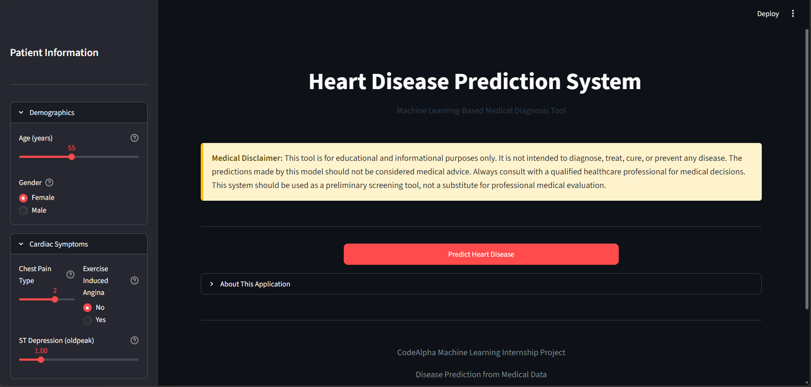
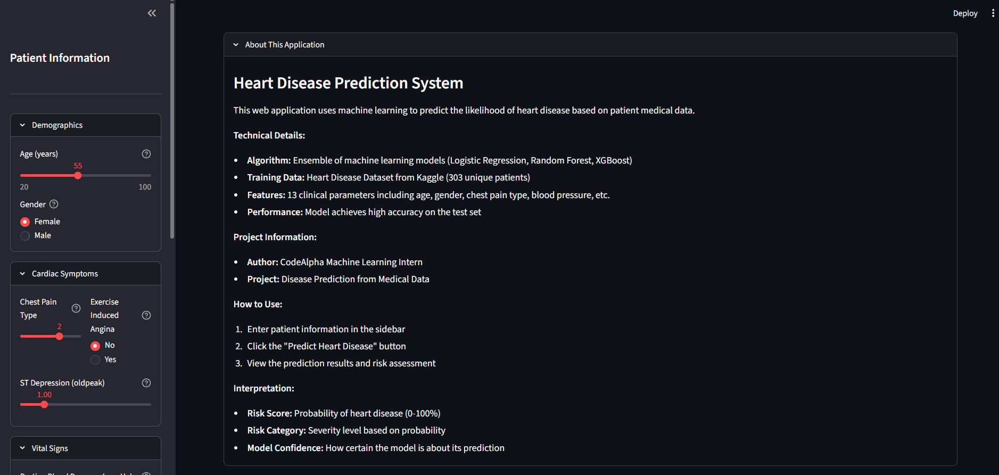
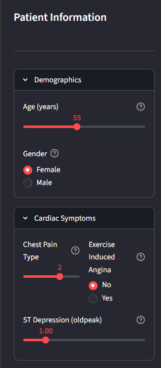
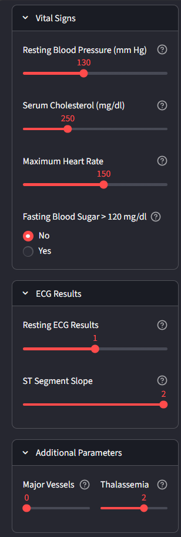
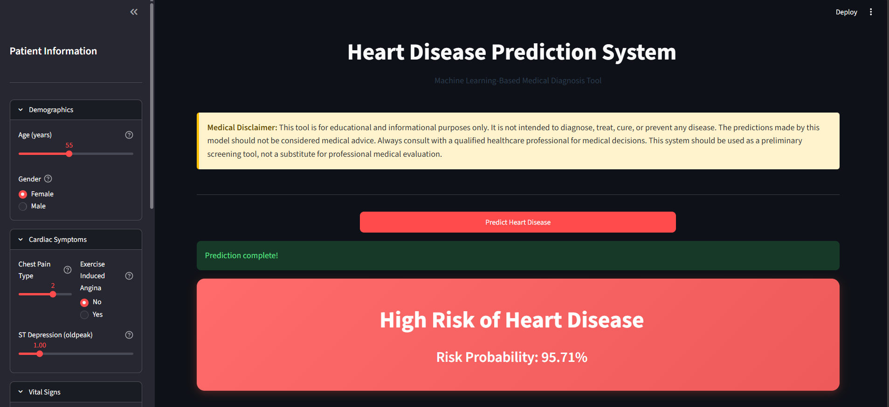
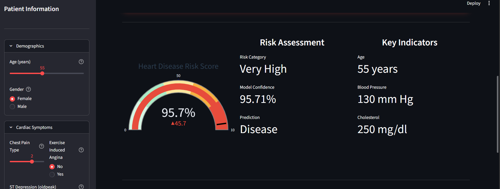
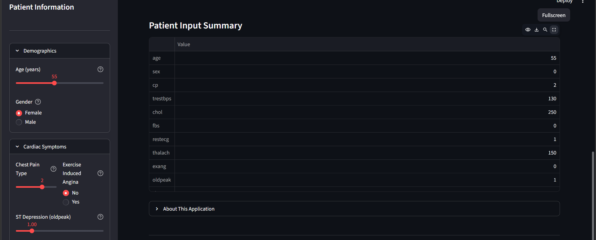

# Heart Disease Prediction System

[](https://www.python.org/downloads/)
[](https://www.codealpha.tech/)

A comprehensive machine learning system for predicting heart disease from patient medical data, developed as part of the CodeAlpha Machine Learning Internship program.

---

## Project Overview

This project implements a complete machine learning pipeline for heart disease prediction using patient health metrics. The system uses multiple classification algorithms to analyze medical attributes and predict the likelihood of heart disease with high accuracy.

The project demonstrates industry-standard machine learning practices including:
- Data preprocessing and cleaning
- Exploratory Data Analysis (EDA)
- Multiple model training and comparison
- Hyperparameter tuning with GridSearchCV
- Model evaluation with multiple metrics
- Interactive web application deployment

## Problem Statement

Heart disease is one of the leading causes of death worldwide. Early detection and risk assessment can significantly improve patient outcomes. This project aims to develop a machine learning system that:

1. Analyzes patient medical data to identify risk factors
2. Predicts the likelihood of heart disease using classification algorithms
3. Provides interpretable results with risk probability scores
4. Offers an intuitive interface for medical screening

## Dataset Description

The project uses the **Kaggle Heart Disease Dataset** containing 1025 records. During preprocessing, duplicate entries are detected and removed, resulting in 303 unique patient records used for model training.

### Features

| Feature | Description | Values/Range |
|---------|-------------|--------------|
| `age` | Age in years | 29 - 77 |
| `sex` | Gender | 1 = Male, 0 = Female |
| `cp` | Chest Pain Type | 0: Typical Angina, 1: Atypical Angina, 2: Non-anginal Pain, 3: Asymptomatic |
| `trestbps` | Resting Blood Pressure (mm Hg) | 94 - 200 |
| `chol` | Serum Cholesterol (mg/dl) | 126 - 564 |
| `fbs` | Fasting Blood Sugar > 120 mg/dl | 1 = True, 0 = False |
| `restecg` | Resting ECG Results | 0: Normal, 1: ST-T Abnormality, 2: LV Hypertrophy |
| `thalach` | Maximum Heart Rate Achieved | 71 - 202 |
| `exang` | Exercise Induced Angina | 1 = Yes, 0 = No |
| `oldpeak` | ST Depression | 0 - 6.2 |
| `slope` | Slope of Peak Exercise ST Segment | 0: Upsloping, 1: Flat, 2: Downsloping |
| `ca` | Number of Major Vessels (0-4) | 0 - 4 |
| `thal` | Thalassemia | 1: Normal, 2: Fixed Defect, 3: Reversible Defect |

### Target Variable

- `1` = Heart Disease Present
- `0` = No Heart Disease

---

## Technology Stack

| Category | Technologies |
|----------|-------------|
| **Language** | Python 3.8+ |
| **Data Processing** | pandas, numpy |
| **Machine Learning** | scikit-learn, XGBoost |
| **Visualization** | matplotlib, seaborn, plotly |
| **Web Application** | Streamlit |
| **Model Persistence** | joblib |
| **Development** | Jupyter Notebook |

---

## Installation Instructions

### Prerequisites

- Python 3.8 or higher
- pip package manager

### Setup Steps

1. **Clone the repository**
```bash
git clone https://github.com/Zararazzaq04/CodeAlpha_tasks/tree/main/CodeAlpha_HeartDiseasePrediction
cd CodeAlpha_Heart_Disease_Prediction
```

2. **Create virtual environment** (recommended)
```bash
python -m venv venv

# On Windows
venv\Scripts\activate

# On macOS/Linux
source venv/bin/activate
```

3. **Install dependencies**
```bash
pip install -r requirements.txt
```

4. **Run the main training script**
```bash
python main.py
```

5. **Launch the Streamlit web application**
```bash
streamlit run app.py
```

---

## Project Structure

```
CodeAlpha_Heart_Disease_Prediction/
│
├── data/
│   └── heart.csv                 # Dataset file
│
├── notebooks/
│   └── heart_disease_analysis.ipynb  # Jupyter notebook with complete analysis
│
├── src/
│   ├── __init__.py
│   ├── preprocessing.py         # Data preprocessing module
│   ├── train_model.py           # Model training module
│   ├── evaluate_model.py        # Model evaluation module
│   ├── predict.py               # Prediction module
│   ├── model_comparison.py      # Model comparison module
│   └── utils.py                 # Utility functions
│
├── models/
│   ├── best_model.pkl            # Saved best model
│   └── scaler.pkl                # Saved feature scaler
│
├── reports/
│   ├── plots/
│   │   ├── target_distribution.png
│   │   ├── correlation_heatmap.png
│   │   ├── age_distribution.png
│   │   ├── cholesterol_distribution.png
│   │   ├── disease_by_gender.png
│   │   ├── disease_by_chest_pain.png
│   │   ├── model_comparison.png
│   │   └── radar_comparison.png
│   │
│   ├── confusion_matrix_logistic_regression.png
│   ├── confusion_matrix_random_forest.png
│   ├── confusion_matrix_svm.png
│   ├── confusion_matrix_xgboost.png
│   ├── roc_curve.png
│   ├── classification_report.txt
│   ├── evaluation_summary.txt
│   └── model_comparison_report.txt
│
├── screenshots/
│   ├── app_interface_1.png
│   ├── app_interface_2.png
│   ├── patient_input_1.png
│   ├── patient_input_2.png
│   ├── prediction_1.png
│   ├── prediction_2.png
│   └── prediction_3.png
│
├── app.py                        # Streamlit web application
├── main.py                       # Main execution script
├── requirements.txt              # Python dependencies
├── README.md                     # Project documentation
└── .gitignore                    # Git ignore rules

```

---

## EDA Results

### Target Distribution

The dataset contains a balanced distribution of target classes:
- **No Disease (0):** ~45% of samples
- **Disease (1):** ~55% of samples

### Key Insights from EDA

1. **Age Distribution**: Patients range from 29-77 years with mean age of ~54 years
2. **Gender Distribution**: Higher proportion of male patients in the dataset
3. **Correlation Analysis**: Strong correlations found between:
   - `cp` (chest pain type) and target
   - `thalach` (max heart rate) and target
   - `slope` and target
   - `oldpeak` (ST depression) and target

4. **Risk Factors Identified**:
   - Non-anginal chest pain shows higher disease prevalence
   - Lower maximum heart rate correlates with higher disease risk
   - Higher ST depression values indicate increased risk

---

## Model Training Process

### Models Implemented

1. **Logistic Regression**
   - Baseline linear classifier
   - Fast training and inference
   - Interpretable coefficients

2. **Random Forest Classifier**
   - Ensemble learning method
   - Handles non-linear relationships
   - Provides feature importance

3. **XGBoost Classifier**
   - Gradient boosting algorithm
   - High performance on tabular data
   - Handles missing values

4. **Support Vector Machine (SVM)**
   - Effective for high-dimensional spaces
   - Uses RBF and linear kernels
   - Probability estimates enabled

### Hyperparameter Tuning

Used **GridSearchCV** with 5-fold cross-validation:

**Random Forest Parameters:**
- `n_estimators`: [50, 100, 200]
- `max_depth`: [5, 10, 15, None]
- `min_samples_split`: [2, 5, 10]
- `min_samples_leaf`: [1, 2, 4]

**XGBoost Parameters:**
- `n_estimators`: [50, 100, 200]
- `max_depth`: [3, 5, 7]
- `learning_rate`: [0.01, 0.1, 0.2]
- `subsample`: [0.6, 0.8, 1.0]

**SVM Parameters:**
- `C`: [0.1, 1, 10]
- `kernel`: ['linear', 'rbf']
- `gamma`: ['scale', 'auto']

---

## Model Comparison Results

| Model | Accuracy | Precision | Recall | F1-Score | ROC-AUC |
|---------|---------|---------|---------|---------|---------|
| Random Forest | 0.7869 | 0.7941 | 0.8182 | 0.8060 | 0.8636 |
| XGBoost | 0.7869 | 0.8125 | 0.7879 | 0.8000 | 0.8604 |
| Logistic Regression | 0.8033 | 0.8000 | 0.8485 | 0.8235 | 0.8712 |
| SVM | 0.8033 | 0.7838 | 0.8788 | 0.8286 | 0.8810 |

**Best Model:** Support Vector Machine (SVM)

**Reason:** SVM achieved the highest ROC-AUC score (0.8810) and highest F1-Score (0.8286), making it the most balanced performer for heart disease prediction.

### Evaluation Metrics

- **Accuracy**: Overall correctness of predictions
- **Precision**: True positives out of predicted positives
- **Recall**: True positives out of actual positives
- **F1-Score**: Harmonic mean of precision and recall
- **ROC-AUC**: Area under ROC curve (model discrimination ability)

---

## Screenshots

The following screenshots demonstrate the application's interface, patient data entry workflow, and prediction results.

---

## 1. Application Interface

The Heart Disease Prediction System provides a modern Streamlit-based dashboard with an intuitive layout for entering patient information and viewing prediction results.

### Main Dashboard



### Application Information Panel

The expandable information section explains the project's purpose, machine learning methodology, and usage instructions.



---

## 2. Patient Data Input

Patient information is entered through categorized input panels that collect important clinical and demographic parameters used for prediction.

### Demographic and Symptom Information

This section collects patient demographics and major cardiac symptoms such as age, gender, chest pain type, exercise-induced angina, and ST depression values.



### Vital Signs and Clinical Parameters

Additional medical information including blood pressure, cholesterol level, ECG results, major vessels, and thalassemia values are provided here.



The model uses the following clinical features:

- Age
- Gender
- Chest Pain Type
- Resting Blood Pressure
- Serum Cholesterol
- Fasting Blood Sugar
- Resting ECG Results
- Maximum Heart Rate
- Exercise-Induced Angina
- ST Depression (Oldpeak)
- ST Segment Slope
- Number of Major Vessels
- Thalassemia

---

## 3. Prediction Results

After processing the patient data, the system generates a prediction along with probability-based risk assessment and visual analytics.

### Disease Prediction Result

The model predicts whether the patient is likely to have heart disease and displays the corresponding risk probability.



### Risk Assessment Dashboard

An interactive gauge chart and key medical indicators help visualize the severity of the predicted risk.



### Patient Input Summary

A complete summary of all entered patient parameters is displayed for verification and transparency.



---

## Usage Guide

### Training the Model

Run the complete ML pipeline:

```bash
python main.py
```

This executes:
1. Data preprocessing and EDA
2. Model training with hyperparameter tuning
3. Model evaluation and comparison
4. Best model selection and saving

### Making Predictions

**Using Python:**

```python
from src.predict import HeartDiseasePredictor

# Initialize predictor
predictor = HeartDiseasePredictor(
    model_path='models/best_model.pkl',
    scaler_path='models/scaler.pkl'
)

# Patient data
patient = {
    'age': 54,
    'sex': 1,
    'cp': 2,
    'trestbps': 130,
    'chol': 250,
    'fbs': 0,
    'restecg': 1,
    'thalach': 150,
    'exang': 0,
    'oldpeak': 1.5,
    'slope': 2,
    'ca': 0,
    'thal': 2
}

# Make prediction
result = predictor.predict(patient)
print(f"Prediction: {result['prediction_label']}")
print(f"Risk: {result['probability_percent']}")
```

**Using Streamlit App:**

```bash
streamlit run app.py
```

---

## Future Improvements

1. **Model Enhancements**
   - Implement deep learning models (neural networks)
   - Add ensemble methods (stacking, voting)
   - Explore automated hyperparameter tuning (Optuna)

2. **Feature Engineering**
   - Create derived features (BMI, risk scores)
   - Implement feature selection techniques
   - Add interaction terms

3. **Deployment**
   - Deploy to cloud platforms (AWS, GCP, Azure)
   - Create REST API using FastAPI
   - Implement batch prediction pipeline

4. **Additional Features**
   - Patient history tracking
   - Risk trend analysis
   - Integration with healthcare systems
   - Multi-language support

5. **Model Explainability**
   - SHAP values for feature importance
   - LIME for local explanations
   - Decision boundary visualization

---

## Acknowledgments

- **CodeAlpha** - For providing the Machine Learning Internship opportunity
- **Kaggle** - For the Heart Disease Dataset
- **Open Source Community** - For the excellent ML libraries and tools

---

## Author

**Zara Razzaq**

B.Tech CSE (AI & ML)
Developed as part of the CodeAlpha Machine Learning Internship Program.

- Project: Disease Prediction from Medical Data
- Domain: Healthcare/Machine Learning
- Duration: Internship Project

---

## Disclaimer

**Important:** This system is developed for educational and research purposes only. It should NOT be used as a substitute for professional medical advice, diagnosis, or treatment. Always seek the advice of qualified healthcare providers with any questions regarding medical conditions. The predictions made by this model are probabilistic estimates and should be interpreted by qualified medical professionals.

---